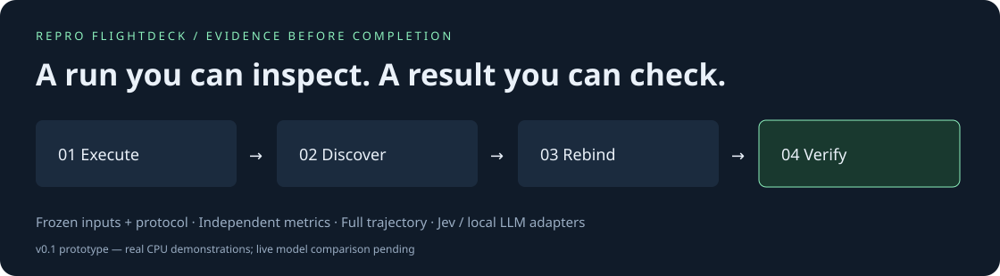

# Repro Flightdeck

**An experiment agent that has to show its evidence.**

[Interactive replay](https://FertayLageeze.github.io/repro-flightdeck/) · [中文](README.zh-CN.md) · [What is actually verified](docs/methodology.md) · [Jev & FDE research notes](docs/research-notes.md)

Run a reviewed experiment, discover broken output contracts, recover file/column bindings, and independently recompute the held-out result. Every decision leaves a replayable record. A successful process exit never counts as a successful experiment.

> **v0.1 is a bounded research prototype.** The public replay contains real CPU experiments driven by a deterministic baseline. Jev, Ollama and confidence-gated hybrid adapters are implemented and tested against response fixtures; live model performance has **not** been measured. The three example cards transfer published methods to small datasets. They do **not** reproduce the papers' original result tables.



## Watch a failure become inspectable

The temperature-scaling example exports `exports/calibrated.csv`, but its manifest expects `probabilities.csv`. The controller records the missing artifact, inspects generated CSV schemas, rebinds `sample_id` and `positive_probability`, then recomputes NLL against frozen labels. No metric or threshold changes.

The negative control exports incorrect probabilities. Binding recovery still succeeds, but verification fails. The run remains **unresolved**.

## Run the same experiment

Python 3.12 is the tested demo environment. The core has no third-party runtime dependency.

```bash
git clone https://github.com/FertayLageeze/repro-flightdeck.git
cd repro-flightdeck
python -m venv .venv
# Linux/macOS: source .venv/bin/activate
# Windows PowerShell: .venv\Scripts\Activate.ps1
python -m pip install -e ".[demo,dev]"
python examples/prepare.py --out runs/cards
repro-flightdeck run runs/cards/temperature/manifest.json --out runs/first --allow-local-exec
repro-flightdeck audit runs/first
```

Open `runs/first/report.html`. The replay works offline and makes no model calls. `audit` checks source, truth, logs and trace integrity, then recomputes the metric.

`--allow-local-exec` acknowledges execution of the reviewed script and its imports. **This is not an OS sandbox.** Use only code you trust, preferably in an isolated disposable environment. No automatic dependency installation, arbitrary shell tools, source rewriting or remote-repository execution is supported.

## Switch the decision backend

All policies use the same controller, verifier and bounded action space.

| Policy | Role | Current validation |
|---|---|---|
| `strict` | Execute, verify the declared contract, stop on failure | Real local runs |
| `rules` (default) | Also recover one unambiguous known column/path mapping | Real local runs |
| `jev` | TypeSafe Choice selects an enumerated action; low confidence stops | Wire-contract/validation tests; no live run |
| `ollama` | An installed local LLM selects an action using JSON schema | Response-fixture tests; no live run |
| `hybrid` | Jev decisions; low-confidence decisions escalate to Ollama | Fallback tests; no live comparison |

```bash
# Set TYPESAFE_API_KEY securely in your environment first. API use may incur costs.
repro-flightdeck run runs/cards/temperature/manifest.json --out runs/jev --policy jev --allow-local-exec

# Replace YOUR_INSTALLED_MODEL with a model already available in local Ollama.
repro-flightdeck run runs/cards/temperature/manifest.json --out runs/llm --policy ollama --model YOUR_INSTALLED_MODEL --allow-local-exec
repro-flightdeck run runs/cards/temperature/manifest.json --out runs/hybrid --policy hybrid --model YOUR_INSTALLED_MODEL --allow-local-exec
```

Jev receives the task title, execution status, artifact paths/column names, and verification feedback. Do not use confidential experiment metadata without reviewing that disclosure. Keys and raw worker logs are not included in model requests; API keys are removed from the worker environment. Live calls are recorded with model, latency and available usage. Missing credentials fail explicitly; they never silently switch to synthetic results. A 10-decision limit bounds calls, **not a dollar budget**.

## Measured baseline, including failures

```bash
python examples/benchmark.py --cards runs/cards --out runs/benchmark
python -m pytest -q
```

The checked-in [baseline record](docs/site/benchmark.json) contains nine runs from Windows/Python 3.12.14. CPU experiments execute from scratch in every arm.

| Method-transfer example | No-recovery baseline | Rule recovery | Injected incorrect result |
|---|---|---|---|
| Temperature scaling, digits 3 vs 8 | Missing output path | NLL 0.191153; accepted | NLL 27.206051; rejected |
| Split conformal, diabetes | Renamed interval columns | Coverage 0.837838; accepted | Coverage 0; rejected |
| RBF SVM, digits | Accuracy 0.98; accepted | Accuracy 0.98; accepted | Accuracy 0; rejected |

Acceptance bounds are engineering checks chosen during demo development, not preregistered scientific claims. In particular, the conformal demo's realized 83.8% coverage is **below its nominal 90% level**; passing the broad smoke-test bound does not establish conditional or empirical 90% coverage. No cross-model leaderboard, speedup, cost saving or novelty claim is made.

## Use your own reviewed experiment

See [the manifest contract](docs/manifest.md). You supply an argv command, reviewed input files, frozen ground-truth labels, a supported metric, and acceptance bounds. The agent may select a generated CSV and bind its columns; it cannot edit the scientific protocol through the tool interface. Keep calibration/training separate from held-out labels. The operating system still permits trusted scripts to read local files; this is not an adversarial isolation boundary.

## Research direction

We are investigating **whether separating bounded decisions from generation helps agents deliver verifiable experiments**. The present contribution is an inspectable prototype and baseline, not a new algorithm. Next milestones:

- Measure rules vs LLM vs Jev vs hybrid on held-out, manually reviewed artifact failures, with equal action budgets, repeat runs, cost and latency.
- Add one author-repository experiment with a pinned commit, published table target, explicit tolerance, clean-room reproduction instructions and a complete failure report.
- Introduce sandboxed source repair only after preserving an independent verifier and explicit compute budgets.

The prior [paired-eval](https://github.com/FertayLageeze/paired-eval), [split-leakage-audit](https://github.com/FertayLageeze/split-leakage-audit), [selective-risk-audit](https://github.com/FertayLageeze/selective-risk-audit), and [paper-evidence-audit](https://github.com/FertayLageeze/paper-evidence-audit) are related utilities; they are not yet runtime dependencies of Flightdeck.

## Contribute and cite

A useful contribution is a small reviewed experiment that **fails honestly**, with a precise expected result and a redistributable artifact. See [CONTRIBUTING.md](CONTRIBUTING.md). Cite this software using [CITATION.cff](CITATION.cff); no paper or DOI is claimed. MIT license covers our code. Demo evidence includes public-data excerpts and derived predictions; see [data attribution](docs/DATA.md) for their separate terms.
